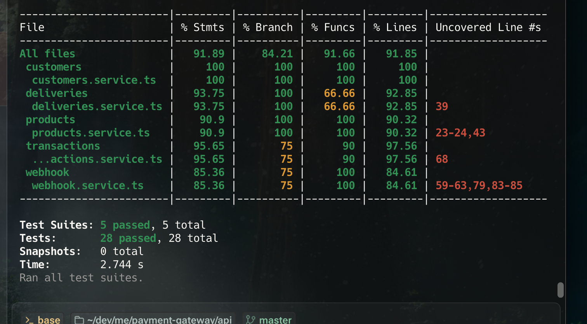
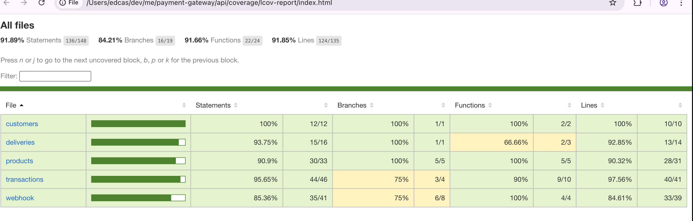

# 🎸 GUITAR MIAU - E-commerce con Pasarela de Pago

Aplicación web para la venta de guitarras con integración de pasarela de pago externa.

## 🌐 Enlaces de Producción

- **FRONTEND**: [https://d1iw1r2yizv6bb.cloudfront.net/](https://d1iw1r2yizv6bb.cloudfront.net/)
- **API**: [https://ppeqi4smpj.us-east-1.awsapprunner.com](https://ppeqi4smpj.us-east-1.awsapprunner.com)
- **DOCUMENTACIÓN API**: [Swagger UI](https://ppeqi4smpj.us-east-1.awsapprunner.com/miau/docs#/)
- **WEBHOOK EVENTOS**: [https://ppeqi4smpj.us-east-1.awsapprunner.com/webhook/payment-status](https://ppeqi4smpj.us-east-1.awsapprunner.com/webhook/payment-status)


## 🚀 Características

- Catálogo de guitarras con vista detallada
- Proceso de pago seguro con tarjeta de crédito
- Integración con pasarela de pago externa
- Gestión de stock 
- Webhooks para actualización de estados de pago

## 🔄 Flujo de Compra

1. **Selección de Producto**
   - El usuario selecciona una guitarra
   - Visualiza detalles y selecciona cantidad
   - Hace clic en "Pagar con tarjeta"

2. **Proceso de Pago**
   - Formulario de datos de tarjeta y envío
   - Resumen de la compra
   - Redirección a la pasarela de pago

3. **Confirmación**
   - Procesamiento del pago
   - Actualización de inventario
   - Confirmación de la transacción

## 🛠️ Tecnologías

- **Frontend**: React.js, TypeScript, Tailwind CSS
- **Backend**: NestJS, TypeORM
- **Base de datos**: PostgreSQL
- **Despliegue**:
  - Frontend: AWS CloudFront
  - Backend: AWS ECS (Elastic Container Service)

## ⚙️ Configuración

### Desarrollo Local

1. Clona el repositorio
2. Instala dependencias:
   ```bash
   # Frontend
   cd front
   npm install
   
   # Backend
   cd ../back
   npm install
   ```
3. Configura las variables de entorno (ver archivos .env.example en cada directorio)
4. Inicia los servicios:
   ```bash
   # Frontend
   cd front
   npm run dev
   
   # Backend
   cd ../back
   npm run start:dev
   ```

### Despliegue

- **Frontend**: Despliegue en CloudFront 
- **Backend**: Despliegue en ECS-AppRunner con contenedores Docker

## 🌐 Webhooks

La aplicación recibe actualizaciones de la pasarela de pago a través de webhooks:
- Actualización de estados de transacciones usando Webhook de eventos: [https://ppeqi4smpj.us-east-1.awsapprunner.com/webhook/payment-status](https://ppeqi4smpj.us-east-1.awsapprunner.com/webhook/payment-status)


## ✅ Cobertura de Pruebas

El backend cuenta con una amplia cobertura de pruebas unitarias para garantizar la calidad del código y el correcto funcionamiento de los servicios. 

### Reporte de Cobertura

A continuación se muestran los reportes de cobertura más recientes:

#### Vista General


#### Reporte Interactivo


### Ejecución de Pruebas

Para ejecutar las pruebas unitarias y generar los reportes de cobertura:

```bash
# En el directorio del backend
cd back

# Ejecutar pruebas con cobertura
npm test:cov

# Para ver el reporte interactivo en el navegador
open coverage/lcov-report/index.html
```

Los reportes detallados de cobertura se generan en la carpeta `coverage/` e incluyen:
- Estadísticas generales de cobertura
- Reporte por archivos
- Líneas cubiertas/no cubiertas
- Reporte interactivo HTML

